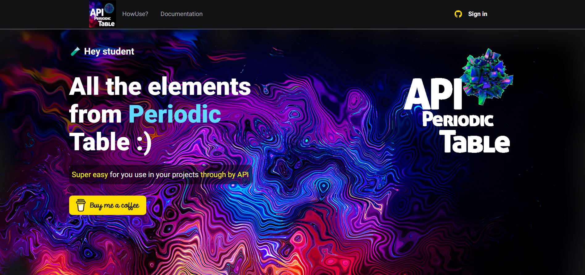
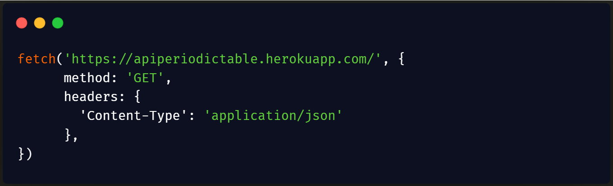
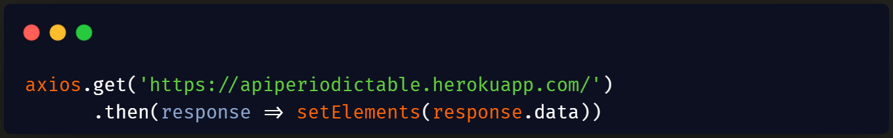
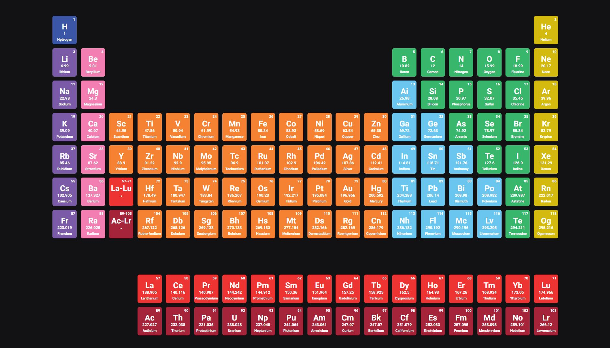

# API Periodic Table

 
  
  
  
  

 

## This API was born out of the need to use periodic table data.
<h3>DEPLOY: <a href="https://apiperiodictable-kt3px29c7-philipeanderson.vercel.app/howuse">API Periodic Table</a></h3>

  

 

After scouring the internet for some API's to consume data from a periodic table and not finding it, I decided to create my own API. 
Despite being a simple model where it is only possible via GET, it was still very challenging. 
I hope it will be useful in some project and that it may have contributed in some way to the dissemination of such rich content. 

## How to access?
### Backend
The backend of this project was built on NodeJS and hosted on Heroku. 
access: https://apiperiodictable.herokuapp.com/  
All API content is in the root path " .../ ", just access the link above and use the data through the GET method. 

### Frontend
The frontend is being built in NextJS using a payment API that in this case was linked to receive donations for the project. 
This API is Stripe in version 20200827. 
Hosting is provided by Vercel 
access: https://apiperiodictable.vercel.app/

## How Use
### Super Easy
Just use tradicional methods of query a JSON document, you can set with axios or fetchAPI for javascript for exemple.
The url for query api is: https://apiperiodictable.herokuapp.com/ she is a JSON format.
  

  
    
  

  

    

## Technologies used!

The dependencies used in the project were: 

npm install --global yarn
### Backend
  * Express  = yarn add express
  * Cors = yarn add cors
  * Body-Parser = yarn add body-parser
  * Morgan = yarn add morgan
  * Nodemon = yarn add nodemon
  
 ### Frontend
  * NextJS = yarn add next
  * Typescript = yarn add typescript
  * React-Dom = yarn add create-react-app
  * React-Icons = yarn add react-icons
  * Stripe = yarn add stripe
  * Sass = yarn add sass

It was still necessary to install the Heroku CLI 
Only after these steps was it possible to see the API working :)

Below is a table with the technologies and their versions.
<table border="1">
  <thead>
    <th>
      Backend
    </th>
    <th>
      NodeJS
    </th>
    <th>
      Express
    </th>
    <th>
      Cors
    </th>
    <th>
      Body-Parser
    </th>
    <th>
      Morgan
    </th>
    <th>
      Nodemon
    </th>
  </thead>
  <tbody>
    <th>
     VERSIONS:
    </th>
     <td>
      16.13.1
    </td>
    <td>
      4.17.2
    </td>
    <td>
      2.8.5
    </td>
    <td>
      1.19.1
    </td>
    <td>
      1.10.0
    </td>
    <td>
      2.0.15
    </td>
  </tbody>
</table>

<table border="1">
  <thead>
    <th>
      Frontend
    </th>
    <th>
      NextJS
    </th>
    <th>
      Typescript
    </th>
    <th>
      React-Dom
    </th>
    <th>
      React-Icons
    </th>
    <th>
      Stripe
    </th>
   <th>
      Sass
    </th>
  </thead>
  <tbody>
    <th>
     VERSIONS:
    </th>
     <td>
      12.0.8
    </td>
    <td>
      4.5.5
    </td>
    <td>
      17.0.2
    </td>
    <td>
      4.3.1
    </td>
    <td>
      8.199.0
    </td>
    <td>
      1.49.0
    </td>
  </tbody>
</table>

## And the Database ? 

Don't be disappointed when I say that all API information is being printed by a const db. 
Located inside the database/database directory. 
The structure chosen was the JSON format as shown below. 

  

## Next steps 😃

So that this application reaches a more professional level:

 * MongoDB Database.
 * Buy your own domain.
 * Update application to TypeScript. (backend)
 * Insert more information for each element.
 * Invite people to participate in the project.

